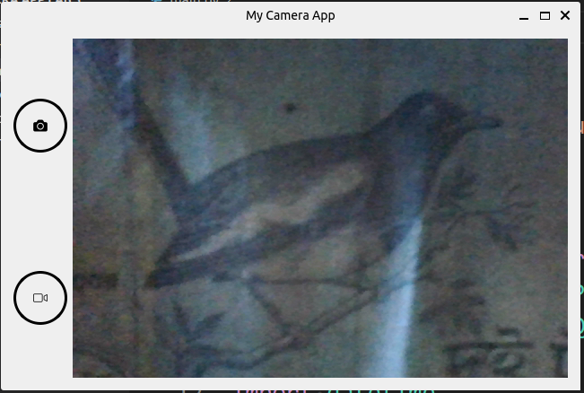

# Camera application with python and opencv2

## Features
1. Capture image using webcam.
2. Record video with webcam.


## How to run
1. Install dependencies:
```
 python install -r requirements.txt
```
2. Run the programme:
```
 python main.py
```